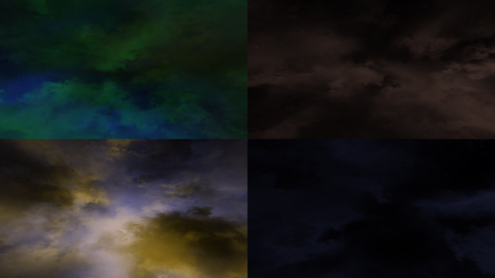

# Space 3D 

Generate random space skybox via OpenGL and GLSL shaders. Can be useful for space-sim games. This project is a port from <https://github.com/wwwtyro/space-3d> which was originally written for WebGL in JavaScript. This works by creating random stars and random nebulas with random colors. The skybox is generated once and the output is baked into a cubemap texture via shaders and a framebuffer. Generating the skybox is also predictable via a seed.

The algorithm that does everything is located in the `src/Skybox.cpp` file (the `generate` class function).



## Usage

Compile the application via CMake and [vcpkg](https://github.com/microsoft/vcpkg) (steps below). Run the `Space3D.exe` executable. **Press spacebar on your keyboard to create new random skybox.**

Feel free to change the generated cubemap resolution to a higher one. The hardcoded value is 1024x1024 but can be changed by adjusting the `generate` function's arguments, but don't make it too big. On GTX 1070 Ti it took slightly more than a second to generate a cubemap of size 4096x4096 pixels. It also eats up a lot of GPU memory resources (4096x4096 RGB8 pixels times 6 sides = 0.28GB)

## Building

1. Make sure you have [vcpkg](https://github.com/microsoft/vcpkg) installed and integrated.
2. Install `glfw3 glm glad` vcpkg packages.
3. Build the project with vcpkg toolchain.

```bash
# Vcpkg dependencies
vcpkg install --triplet x64-windows glfw3 glm glad

# Clone
git clone https://github.com/matusnovak/glfw-space-3d.git
cd glfw-space-3d

# Create build dir and configure
mkdir build
cd build
cmake \
  -G "Visual Studio 16 2019" \
  -DCMAKE_TOOLCHAIN_FILE=C:/tools/vcpkg/scripts/buildsystems/vcpkg.cmake \
  ..

# Build it
cmake --build .

# Run it
./Debug/Space3D.exe
```

## Files

* `src/Shader.cpp` - This is a simple wrapper for a basic OpenGL shader program.
* `src/Skybox.cpp` - **Where all of the magic happens.**
* `src/Vao.cpp` - Simple wrapper for OpenGL vertex array object.
* `src/Vbo.cpp` - Simple wrapper for OpenGL vertex buffer object.
* `src/Window.cpp` - GLFW window code and rendering of the generated skybox cubemap from Skybox.cpp

